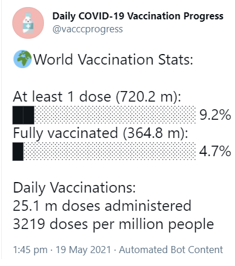
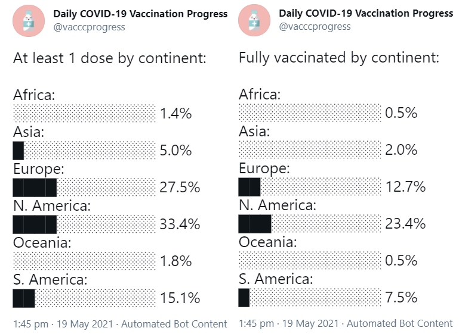
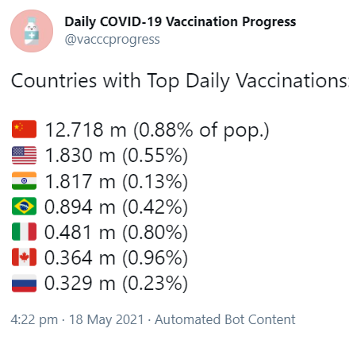

<!-- README.md is generated from README.Rmd. Please edit that file -->

```{r, include = FALSE}
knitr::opts_chunk$set(
  collapse = TRUE,
  comment = "#>"
)
```

# Daily COVID-19 Vaccination Progress


Code for [`@vacccprogress`](https://twitter.com/vacccprogress) Twitter bot. 

Tweets daily COVID-19 Vaccination progress. 

Data taken from [Our World In Data](https://ourworldindata.org/covid-vaccinations) and always refers to *day before*.


#### **Right now the bot will tweet out three types of tweets:**

> 1.) Worldwide vaccination progress



> 2.) Vaccination by continent




> 3.) Top 7 Countries with most administered vaccinations each day




Let me know if you'd be interested in other stats for it to tweet out!
